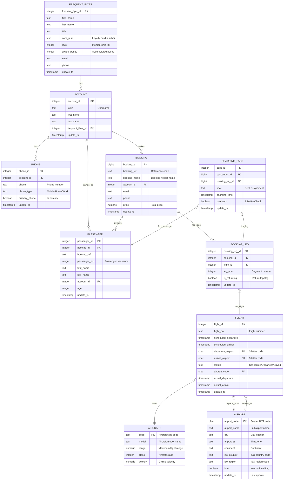

# postgres_air Database - ER Diagram

## Mermaid ER Diagram

## Relationships Summary

| From Table | Relationship | To Table | FK Column | Description |
|------------|--------------|----------|-----------|-------------|
| `account` | N:1 | `frequent_flyer` | `frequent_flyer_id` | Account linked to loyalty program |
| `phone` | N:1 | `account` | `account_id` | Multiple phones per account |
| `booking` | N:1 | `account` | `account_id` | Bookings made by account |
| `passenger` | N:1 | `booking` | `booking_id` | Passengers on a booking |
| `passenger` | N:1 | `account` | `account_id` | Passenger's account (if registered) |
| `booking_leg` | N:1 | `booking` | `booking_id` | Flight segments in booking |
| `booking_leg` | N:1 | `flight` | `flight_id` | Links to actual flight |
| `flight` | N:1 | `aircraft` | `aircraft_code` | Aircraft type for flight |
| `flight` | N:1 | `airport` | `departure_airport` | Origin airport |
| `flight` | N:1 | `airport` | `arrival_airport` | Destination airport |
| `boarding_pass` | N:1 | `passenger` | `passenger_id` | Pass for passenger |
| `boarding_pass` | N:1 | `booking_leg` | `booking_leg_id` | Pass for flight segment |

## Table Statistics

| Table | Primary Key | Foreign Keys | Purpose |
|-------|-------------|--------------|---------|
| `aircraft` | `code` | 0 | Aircraft fleet catalog |
| `airport` | `airport_code` | 0 | Airport master data |
| `frequent_flyer` | `frequent_flyer_id` | 0 | Loyalty program members |
| `account` | `account_id` | 1 | User accounts |
| `phone` | `phone_id` | 1 | Account phone numbers |
| `booking` | `booking_id` | 1 | Flight reservations |
| `passenger` | `passenger_id` | 2 | Travelers on bookings |
| `flight` | `flight_id` | 3 | Scheduled flights |
| `booking_leg` | `booking_leg_id` | 2 | Flight segments in bookings |
| `boarding_pass` | `pass_id` | 2 | Boarding documents |

## Schema Design Notes

1. **Core Entities (No FKs)**: `aircraft`, `airport`, `frequent_flyer` - These are master data tables
2. **Central Hub**: `booking` connects accounts to flights through `booking_leg`
3. **Junction Pattern**: `booking_leg` acts as a junction between `booking` and `flight`
4. **Dual Airport Reference**: `flight` references `airport` twice (departure + arrival)
5. **Optional Relationships**: Many FKs are nullable (e.g., `account_id` in `passenger`)
